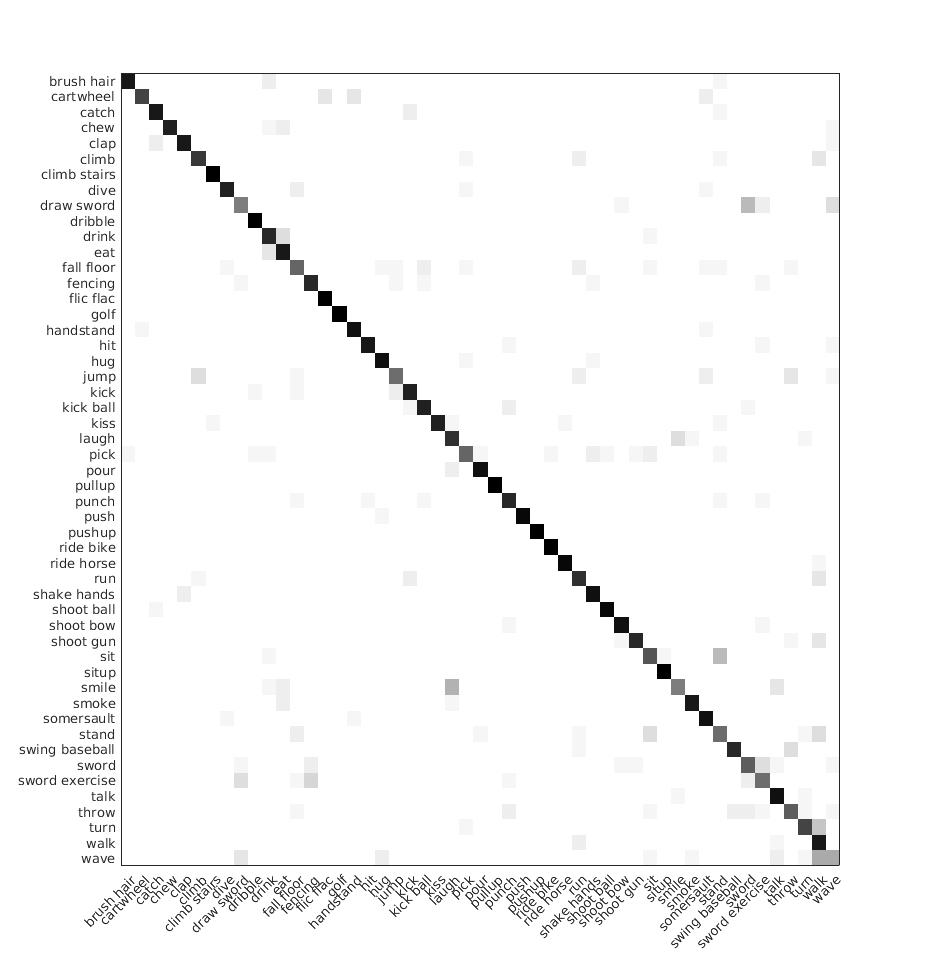

# confusion-matrix
Create confusion matrix of HMDB-51 dataset   

The input label is in 'hmdb_rgb1.txt' with the format: 
<code>number label prediction</code> 
<code>1 22 22</code> 
<code>2 2 2</code> 
<code>3 2 2</code>  

The results as shown in Fig. below 

